# hammurabi

## Sprint - Initial
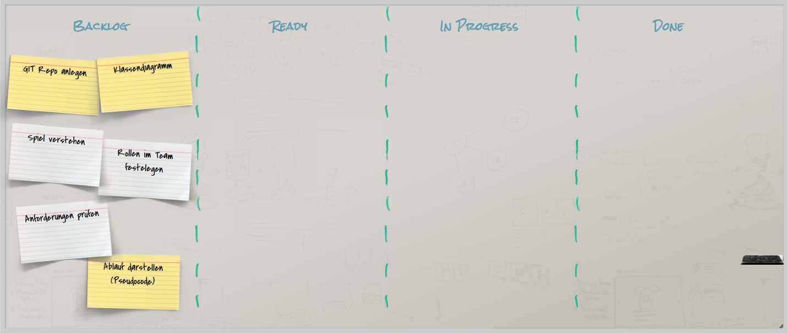

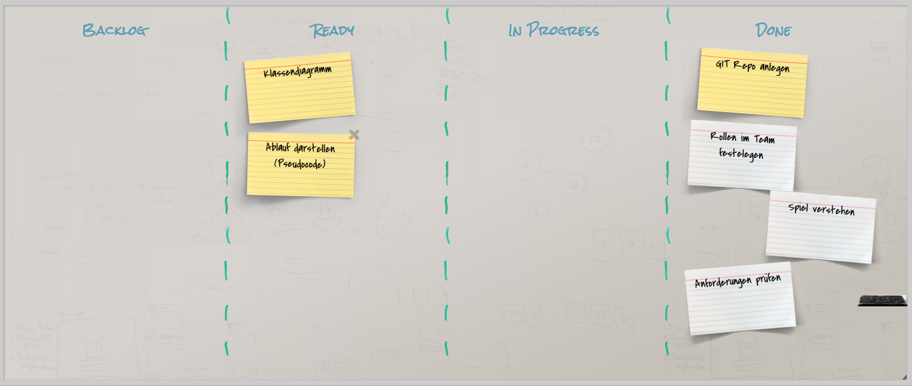
Entwurf des Klassen- sowie des Ablaufdiagrammes:
Klassendiagramm:
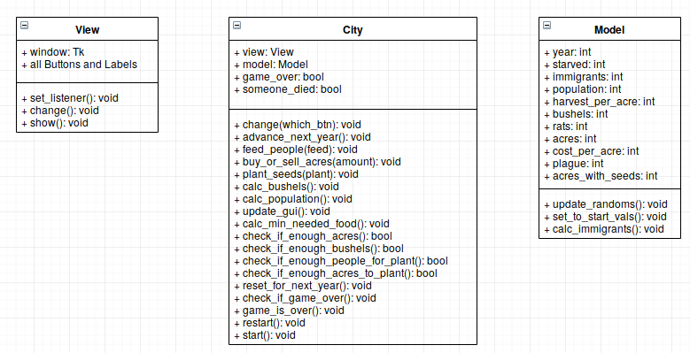
Ablaufdiagramm:
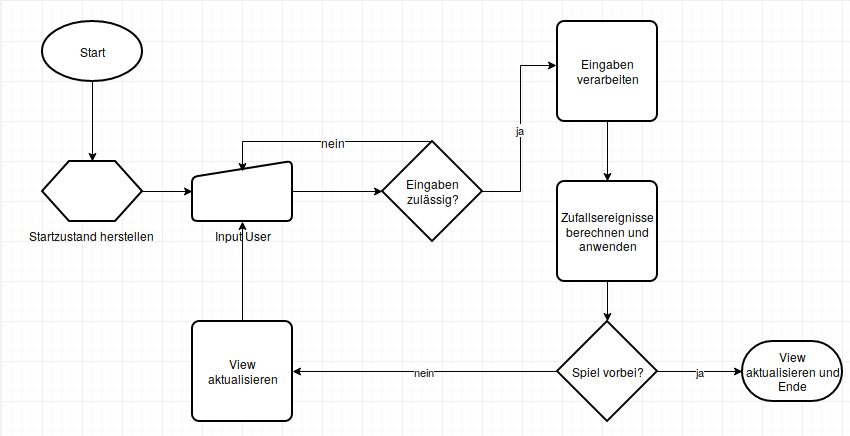
## Sprint - 1
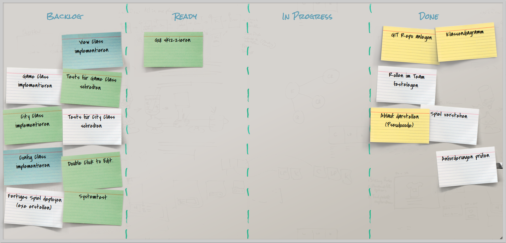
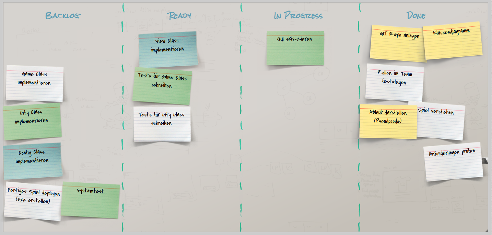
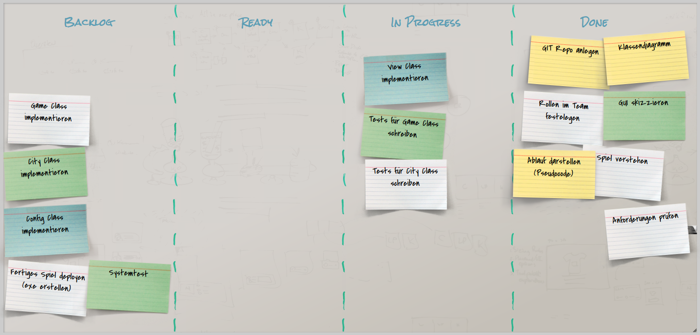
## Sprint - 2
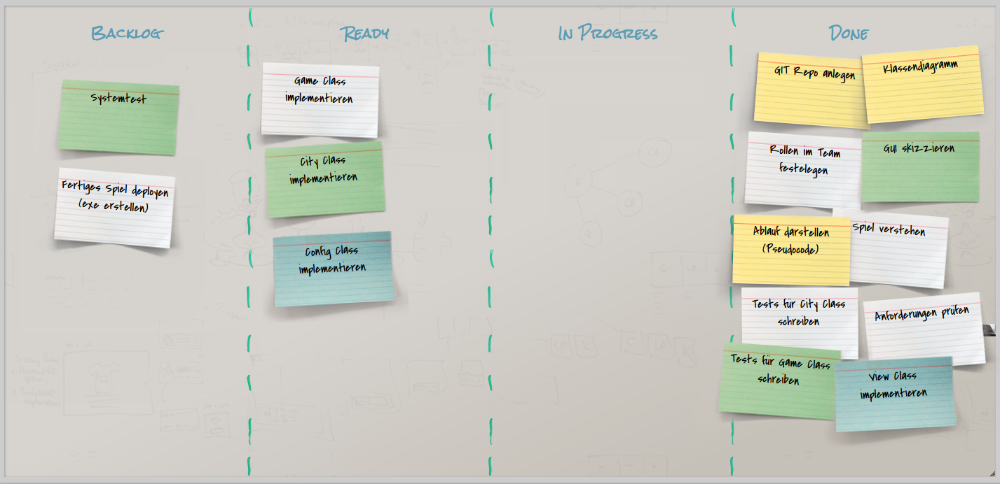
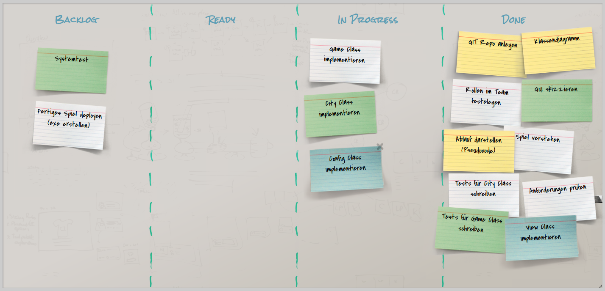
## Sprint - 3
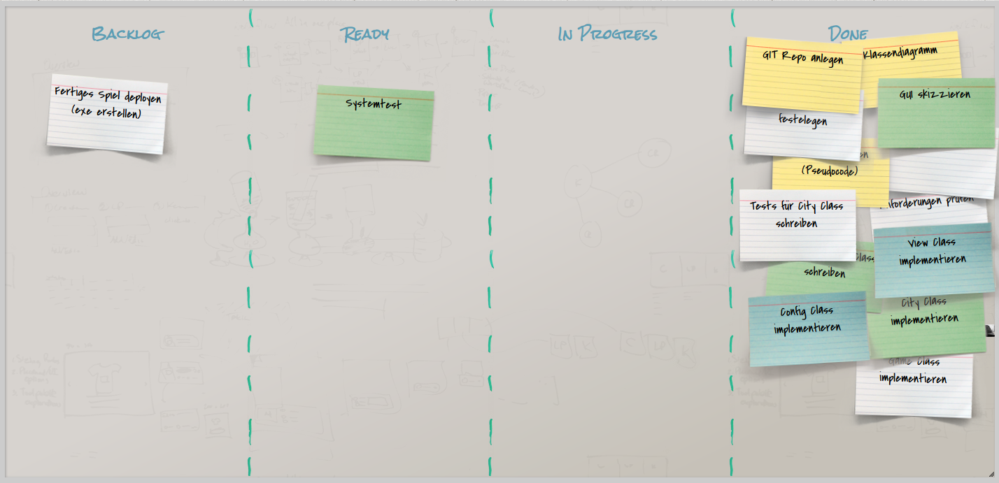
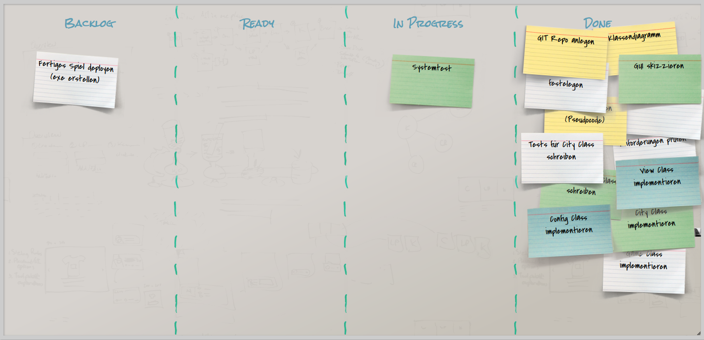
## Sprint - 4
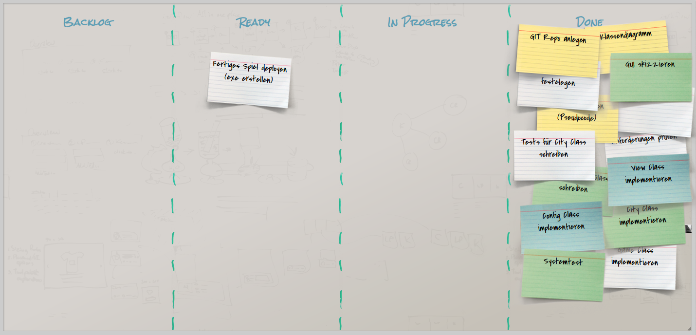
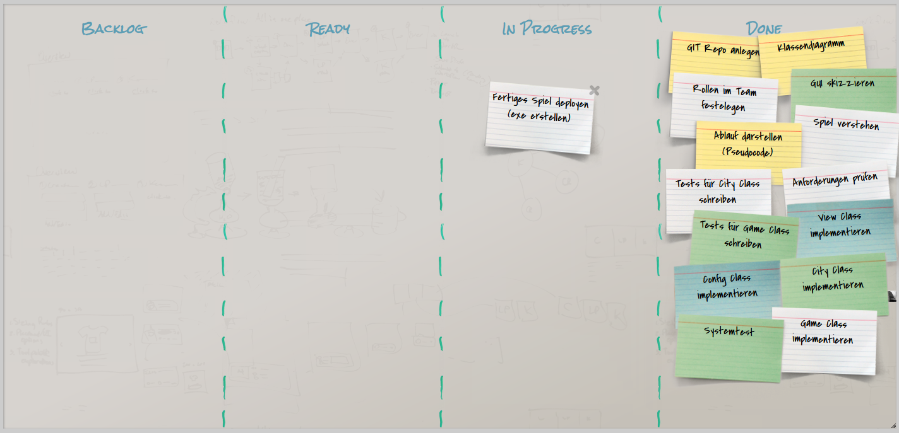
## Done - Übergabe
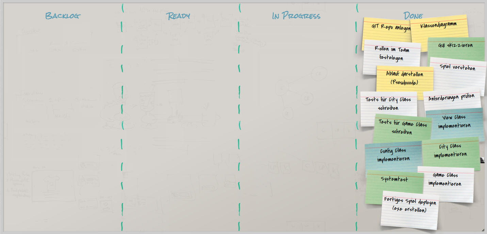